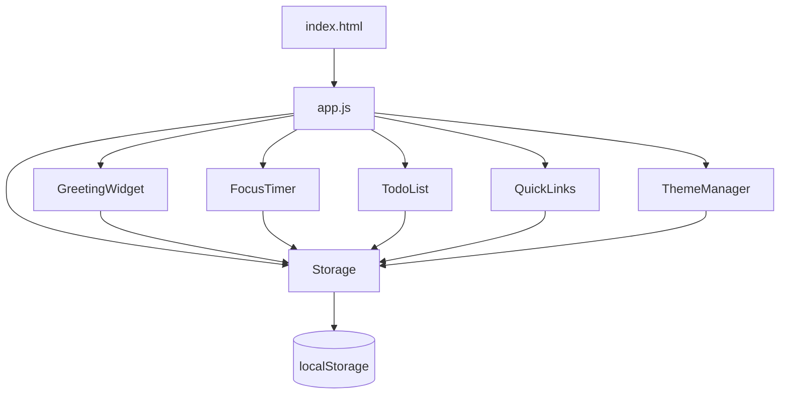
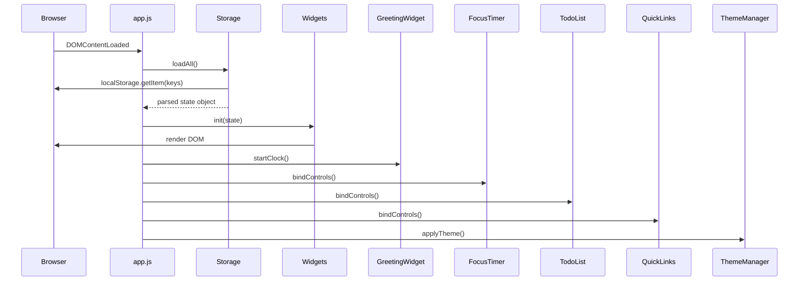
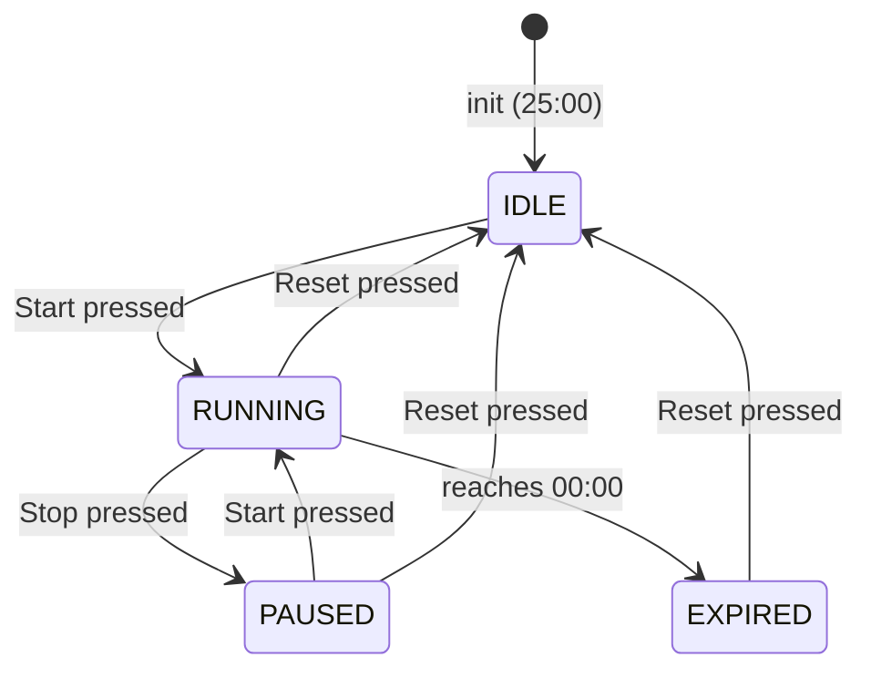

# Design Document

## Overview

The Life Dashboard is a single-page web application (SPA) built with plain HTML, CSS, and Vanilla JavaScript — no frameworks, no build tools, no backend. It runs entirely in the browser and persists all user data via the Browser Local Storage API.

The application is structured as three files:
- `index.html` — the single HTML entry point
- `css/style.css` — all styling including light/dark theme variables
- `js/app.js` — all application logic

The dashboard is composed of five independent widgets rendered on a single page:
1. **Greeting Widget** — displays current time, date, and a time-sensitive personalized greeting
2. **Focus Timer** — a 25-minute countdown timer with Start/Stop/Reset controls
3. **To-Do List** — full task management with add/edit/complete/delete/sort
4. **Quick Links** — user-defined website shortcuts rendered as clickable buttons
5. **Theme Toggle** — switches between Light and Dark color schemes

All state is stored in `localStorage` under namespaced keys. There is no network communication. The app works via the `file://` protocol without a web server.

---

## Architecture

The application follows a simple **event-driven, module-per-widget** architecture. Each widget owns its own state management, DOM rendering, and localStorage read/write logic. A shared `Storage` utility module provides a consistent interface for serialization, deserialization, and error handling.



### Initialization Flow



### Design Decisions

- **No framework**: Keeps the app dependency-free, file-protocol compatible, and trivially portable.
- **Module pattern via IIFE or ES modules**: Each widget is encapsulated to avoid global namespace pollution. Since the app must work via `file://`, ES modules with `type="module"` are used (supported in all modern browsers without a server).
- **Synchronous localStorage reads at startup**: All data is loaded synchronously before the first render to prevent flash of default content.
- **Theme applied via CSS custom properties on `<html>`**: A `data-theme` attribute on `<html>` switches between two sets of CSS variables, enabling instant theme application without JavaScript style manipulation.

---

## Components and Interfaces

### Storage Module

Provides a unified interface for all localStorage operations.

```javascript
const Storage = {
  KEYS: {
    TASKS: 'ld_tasks',
    LINKS: 'ld_links',
    NAME: 'ld_name',
    THEME: 'ld_theme',
    SORT_ORDER: 'ld_sort_order',
  },

  // Returns parsed value or null on failure
  get(key) { ... },

  // Returns true on success, false on failure (quota exceeded, etc.)
  set(key, value) { ... },

  // Loads all keys, returns defaults for missing/invalid entries
  loadAll() { ... },
};
```

**Error handling**: `set()` wraps `localStorage.setItem()` in a try/catch. On failure it dispatches a custom `storage:error` event on `document`, which a global error handler listens to and displays a non-blocking toast notification.

---

### GreetingWidget

Responsible for displaying the clock, date, and personalized greeting.

**Interface:**
```javascript
const GreetingWidget = {
  init(name) { ... },       // Renders initial state, starts clock interval
  setName(name) { ... },    // Updates displayed name and persists to storage
  tick() { ... },           // Called every 60s to update time/date/greeting
};
```

**Greeting logic:**

| Time Range | Greeting |
|---|---|
| 05:00 – 11:59 | Good morning |
| 12:00 – 17:59 | Good afternoon |
| 18:00 – 21:59 | Good evening |
| 22:00 – 04:59 | Good night |

The name defaults to `"Friend"` when the stored name is empty or absent.

**Clock update**: Uses `setInterval` with a 60-second interval. The interval is started on `init()` and the first tick fires immediately.

---

### FocusTimer

Manages the countdown timer state machine.

**States:**



**Interface:**
```javascript
const FocusTimer = {
  init() { ... },
  start() { ... },
  stop() { ... },
  reset() { ... },
  tick() { ... },   // Called by setInterval every 1000ms when RUNNING
};
```

**Control states by timer state:**

| Timer State | Start | Stop |
|---|---|---|
| IDLE | enabled | disabled |
| RUNNING | disabled | enabled |
| PAUSED | enabled | disabled |
| EXPIRED | disabled | disabled |

The timer uses `setInterval` (1000ms) when running. On `reset()` or `stop()`, `clearInterval` is called immediately.

---

### TodoList

Manages the full lifecycle of tasks.

**Interface:**
```javascript
const TodoList = {
  init(tasks, sortOrder) { ... },
  addTask(description) { ... },
  editTask(id, newDescription) { ... },
  toggleComplete(id) { ... },
  deleteTask(id) { ... },
  setSortOrder(order) { ... },
  render() { ... },
  persist() { ... },
};
```

**Sort orders:**
- `'date'` — creation timestamp ascending (default)
- `'alpha'` — alphabetical by description (A–Z)
- `'completion'` — incomplete tasks first, then completed

**Inline editing**: When the edit control is activated, the task's `<li>` switches from display mode to edit mode by swapping a `<span>` for an `<input>`. Pressing Enter or clicking Save confirms; pressing Escape cancels.

**Validation**: Empty or whitespace-only descriptions are rejected with an inline `<span class="error">` message inserted adjacent to the input.

---

### QuickLinks

Manages user-defined website shortcuts.

**Interface:**
```javascript
const QuickLinks = {
  MAX_LINKS: 20,
  init(links) { ... },
  addLink(label, url) { ... },
  deleteLink(id) { ... },
  render() { ... },
  persist() { ... },
  validateUrl(url) { ... },  // Returns true if url starts with http:// or https:// and has a non-empty host
};
```

**URL validation**: A URL is valid if it matches the pattern `^https?:\/\/.+` and the `URL` constructor does not throw when parsing it (ensuring a valid host is present).

**Limit enforcement**: If 20 links are already saved, the add form is rejected with an inline message before any storage write.

**Error display**: Storage failures dispatch the `storage:error` event, which triggers the global toast notification.

---

### ThemeManager

Manages the light/dark theme.

**Interface:**
```javascript
const ThemeManager = {
  THEMES: { LIGHT: 'light', DARK: 'dark' },
  init(storedTheme) { ... },   // Applies theme before first paint
  toggle() { ... },
  apply(theme) { ... },        // Sets data-theme on <html>, persists to storage
};
```

**Implementation**: `apply()` sets `document.documentElement.setAttribute('data-theme', theme)`. CSS custom properties defined under `[data-theme="light"]` and `[data-theme="dark"]` selectors handle all visual changes. This ensures the theme switch happens within a single style recalculation — well within the 100ms requirement.

**Default**: If the stored theme is missing or not `'light'`/`'dark'`, defaults to `'light'`.

---

## Data Models

All data is stored in `localStorage` as JSON strings under namespaced keys prefixed with `ld_`.

### Task

```typescript
interface Task {
  id: string;           // UUID v4 generated at creation time
  description: string;  // 1–200 characters
  completed: boolean;   // false by default
  createdAt: number;    // Unix timestamp (Date.now()) at creation
}
```

**localStorage key**: `ld_tasks`
**Default value**: `[]` (empty array)

### QuickLink

```typescript
interface QuickLink {
  id: string;    // UUID v4 generated at creation time
  label: string; // 1–50 characters
  url: string;   // 1–2048 characters, must start with http:// or https://
}
```

**localStorage key**: `ld_links`
**Default value**: `[]` (empty array)

### User Name

**localStorage key**: `ld_name`
**Type**: `string`
**Default value**: `""` (empty string, renders as "Friend")

### Theme

**localStorage key**: `ld_theme`
**Type**: `"light" | "dark"`
**Default value**: `"light"`

### Sort Order

**localStorage key**: `ld_sort_order`
**Type**: `"date" | "alpha" | "completion"`
**Default value**: `"date"`

### Storage Schema Summary

```json
{
  "ld_tasks": "[{\"id\":\"...\",\"description\":\"...\",\"completed\":false,\"createdAt\":1234567890}]",
  "ld_links": "[{\"id\":\"...\",\"label\":\"...\",\"url\":\"https://...\"}]",
  "ld_name": "Alice",
  "ld_theme": "dark",
  "ld_sort_order": "alpha"
}
```

### Validation and Recovery

On load, each key is validated:

| Key | Valid condition | Default on failure |
|---|---|---|
| `ld_tasks` | Parses as JSON array of Task objects | `[]` |
| `ld_links` | Parses as JSON array of QuickLink objects | `[]` |
| `ld_name` | Parses as string | `""` |
| `ld_theme` | Value is `"light"` or `"dark"` | `"light"` |
| `ld_sort_order` | Value is `"date"`, `"alpha"`, or `"completion"` | `"date"` |

---

## Correctness Properties

*A property is a characteristic or behavior that should hold true across all valid executions of a system — essentially, a formal statement about what the system should do. Properties serve as the bridge between human-readable specifications and machine-verifiable correctness guarantees.*

### Property 1: Greeting time-range correctness

*For any* hour value in 0–23, `getGreeting(hour)` SHALL return exactly one of {"Good morning", "Good afternoon", "Good evening", "Good night"}, and the returned greeting SHALL correspond to the correct time range: hours 5–11 → "Good morning", hours 12–17 → "Good afternoon", hours 18–21 → "Good evening", hours 22–23 and 0–4 → "Good night".

**Validates: Requirements 1.3, 1.4, 1.5, 1.6**

---

### Property 2: Name fallback to "Friend"

*For any* name value that is an empty string, null, or undefined, `getDisplayName(value)` SHALL return the string "Friend".

**Validates: Requirements 1.9**

---

### Property 3: Time format correctness

*For any* hour value in 0–23 and minute value in 0–59, `formatTime(hour, minute)` SHALL return a string of the form "HH:MM" where HH and MM are zero-padded to two digits and represent the input values exactly.

**Validates: Requirements 1.1**

---

### Property 4: Date format correctness

*For any* valid JavaScript `Date` object, `formatDate(date)` SHALL return a string matching the pattern `"<Weekday>, <DD> <Month> <YYYY>"` where the weekday and month are the correct English names for that date.

**Validates: Requirements 1.2**

---

### Property 5: Task addition round-trip

*For any* valid task description (a non-empty, non-whitespace-only string of 1–200 characters), calling `addTask(description)` and then reading `ld_tasks` from localStorage SHALL produce a task array that contains exactly one entry with that description.

**Validates: Requirements 3.2, 6.1**

---

### Property 6: Whitespace task rejection

*For any* string composed entirely of whitespace characters (spaces, tabs, newlines, or any combination), calling `addTask(description)` SHALL return a validation error and the task list in localStorage SHALL remain unchanged.

**Validates: Requirements 3.3**

---

### Property 7: Task completion toggle idempotence

*For any* task with an arbitrary initial completion state, calling `toggleComplete(id)` twice SHALL return the task to its original completion state, and the value persisted in localStorage SHALL reflect that original state.

**Validates: Requirements 3.6**

---

### Property 8: Sort order correctness

*For any* list of tasks with arbitrary descriptions and completion states, sorting by "alpha" SHALL produce a list where each task's description is lexicographically ≤ the next task's description; sorting by "completion" SHALL produce a list where all incomplete tasks appear before all completed tasks.

**Validates: Requirements 3.8**

---

### Property 9: Sort order persistence round-trip

*For any* valid sort order value ("date", "alpha", or "completion"), calling `setSortOrder(order)` and then reading `ld_sort_order` from localStorage SHALL return the same sort order value.

**Validates: Requirements 3.10**

---

### Property 10: Quick Link URL validation

*For any* URL string that does not match the pattern `^https?:\/\/.+` with a non-empty host component, `validateUrl(url)` SHALL return false and no write to localStorage SHALL occur.

**Validates: Requirements 4.3**

---

### Property 11: Quick Link limit enforcement

*For any* Quick Links collection that already contains exactly 20 entries, calling `addLink(label, url)` SHALL return a limit-exceeded error and the collection size in localStorage SHALL remain 20.

**Validates: Requirements 4.8**

---

### Property 12: Quick Link addition round-trip

*For any* valid Quick Link (label of 1–50 characters, valid URL, collection size < 20), calling `addLink(label, url)` and then reading `ld_links` from localStorage SHALL produce a link array that contains an entry with that exact label and URL.

**Validates: Requirements 4.2**

---

### Property 13: Theme persistence round-trip

*For any* theme value in {"light", "dark"}, calling `ThemeManager.apply(theme)` and then reading `ld_theme` from localStorage SHALL return the same theme value.

**Validates: Requirements 5.3**

---

### Property 14: Invalid theme defaults to light

*For any* value that is not exactly "light" or "dark" (including null, undefined, empty string, or arbitrary strings), `resolveTheme(value)` SHALL return "light".

**Validates: Requirements 5.4**

---

### Property 15: Storage serialization round-trip

*For any* valid application state object (tasks array, links array, name string, theme string), serializing it to JSON via `Storage.set()` and then deserializing it via `Storage.get()` SHALL produce a structurally equivalent object with all fields preserved.

**Validates: Requirements 6.1, 6.2**

---

### Property 16: Storage recovery from corrupt data

*For any* localStorage key whose stored value is an arbitrary string that is not valid JSON, or is valid JSON but does not match the expected structure for that key, `Storage.loadAll()` SHALL return the correct default value for that key (tasks: `[]`, links: `[]`, name: `""`, theme: `"light"`, sortOrder: `"date"`) and SHALL NOT throw an error.

**Validates: Requirements 6.3**

---

### Property 17: Focus Timer control state invariant

*For any* timer state in {IDLE, RUNNING, PAUSED, EXPIRED}, the enabled/disabled state of the Start and Stop controls SHALL match the specification table: IDLE → Start enabled, Stop disabled; RUNNING → Start disabled, Stop enabled; PAUSED → Start enabled, Stop disabled; EXPIRED → Start disabled, Stop disabled.

**Validates: Requirements 2.7, 2.8, 2.9**

---

### Property 18: Focus Timer reset invariant

*For any* timer state (RUNNING, PAUSED, or EXPIRED) with any remaining time value, calling `reset()` SHALL transition the timer to IDLE state with remaining time of exactly 1500 seconds (25:00), and any active interval SHALL be cleared.

**Validates: Requirements 2.5**

---

## Error Handling

### localStorage Write Failures

`Storage.set()` wraps every `localStorage.setItem()` call in a try/catch. On failure (e.g., `QuotaExceededError`):
1. The error is caught silently (no uncaught exception).
2. A custom `storage:error` DOM event is dispatched on `document`.
3. A global listener renders a non-blocking toast notification: "Could not save your changes. Storage may be full."
4. The toast auto-dismisses after 5 seconds.

### localStorage Read Failures / Corrupt Data

`Storage.get()` wraps `localStorage.getItem()` and `JSON.parse()` in a try/catch. On failure:
1. Returns `null`.
2. `loadAll()` maps `null` to the appropriate default value for each key.
3. No error is shown to the user for read failures — the app silently uses defaults.

### Quick Links Storage Error

Requirement 4.7 specifies a visible error message for Quick Links storage failures specifically. This is handled by the global `storage:error` event listener, which displays the toast notification for all storage failures including Quick Links.

### Input Validation Errors

All validation errors (empty task, invalid URL, label too long, etc.) are displayed as inline `<span class="error">` elements adjacent to the relevant input field. These are cleared when the user modifies the input.

### Timer Edge Cases

- If `setInterval` fires slightly late (browser throttling), the timer displays the correct remaining time by computing `endTime - Date.now()` rather than decrementing a counter. This prevents drift.
- On `reset()`, `clearInterval` is called before any state update to prevent a final tick from firing after reset.

---

## Testing Strategy

### Overview

The testing strategy uses a dual approach:
- **Unit tests** for specific examples, edge cases, and error conditions
- **Property-based tests** for universal properties across all valid inputs

The application logic in `js/app.js` is structured so that pure functions (greeting logic, validation, sort comparators, URL validation, storage serialization) can be tested in isolation from the DOM.

### Property-Based Testing

**Library**: [fast-check](https://github.com/dubzzz/fast-check) (JavaScript property-based testing library)

**Configuration**: Each property test runs a minimum of **100 iterations**.

**Tag format**: Each property test is tagged with a comment:
`// Feature: life-dashboard, Property N: <property_text>`

**Properties to implement as PBT tests:**

| Property | Test Description |
|---|---|
| Property 1 | Generate arbitrary hour values (0–23), verify `getGreeting(hour)` returns the correct greeting for that hour's range |
| Property 2 | Generate empty strings, null, and undefined values, verify `getDisplayName()` returns "Friend" |
| Property 3 | Generate valid hour (0–23) and minute (0–59) values, verify `formatTime()` returns zero-padded HH:MM |
| Property 4 | Generate arbitrary valid Date objects, verify `formatDate()` returns the correct "Weekday, DD Month YYYY" format |
| Property 5 | Generate valid task descriptions (1–200 non-whitespace chars), add task, read localStorage, verify presence |
| Property 6 | Generate whitespace-only strings, verify `addTask()` rejects and list is unchanged |
| Property 7 | Generate tasks with arbitrary completion states, toggle twice, verify original state restored |
| Property 8 | Generate random task lists, sort by "alpha" and "completion", verify sort invariants hold |
| Property 9 | Generate valid sort order values, set and read back from localStorage, verify round-trip |
| Property 10 | Generate arbitrary URL strings not matching `^https?://\S+`, verify `validateUrl()` returns false |
| Property 11 | Generate collections of exactly 20 links, verify `addLink()` rejects the 21st |
| Property 12 | Generate valid label/URL pairs with collection size < 20, add link, read localStorage, verify presence |
| Property 13 | Generate "light"/"dark" values, set theme, read back from localStorage, verify round-trip |
| Property 14 | Generate arbitrary non-theme strings and null/absent values, verify `resolveTheme()` returns "light" |
| Property 15 | Generate arbitrary valid state objects, serialize via `Storage.set()`, deserialize via `Storage.get()`, verify equivalence |
| Property 16 | Generate arbitrary corrupt JSON strings for each key, call `Storage.loadAll()`, verify correct defaults returned |
| Property 17 | For each timer state {IDLE, RUNNING, PAUSED, EXPIRED}, verify Start/Stop control enabled states match specification table |
| Property 18 | Generate arbitrary timer states (RUNNING, PAUSED, EXPIRED), call `reset()`, verify IDLE state with 1500 seconds remaining |

### Unit Tests

**Framework**: [Jest](https://jestjs.io/) with jsdom for DOM simulation

**Focus areas:**
- Greeting widget: specific time boundary values (04:59, 05:00, 11:59, 12:00, 17:59, 18:00, 21:59, 22:00)
- Focus Timer: state transitions at exact boundaries (00:01 → 00:00 → EXPIRED)
- To-Do List: add/edit/delete/sort with concrete examples
- Quick Links: URL validation with specific valid and invalid examples
- Theme: default fallback behavior
- Storage: recovery from missing keys

### Integration Tests

- Full page load with pre-populated localStorage: verify all widgets restore correctly
- Theme applied before first paint: verify `data-theme` attribute is set before any widget renders
- Storage write failure: mock `localStorage.setItem` to throw, verify toast notification appears

### Accessibility Testing

- Manual testing with screen readers (NVDA/VoiceOver) for semantic HTML structure
- Automated contrast ratio checks using axe-core or Lighthouse
- Keyboard navigation: all interactive controls reachable and operable via Tab/Enter/Space

### Browser Compatibility Testing

Manual smoke tests in Chrome, Firefox, Edge, and Safari covering:
- Timer countdown accuracy over a full 25-minute session
- localStorage persistence across page reloads
- Theme toggle visual correctness
- `file://` protocol operation
